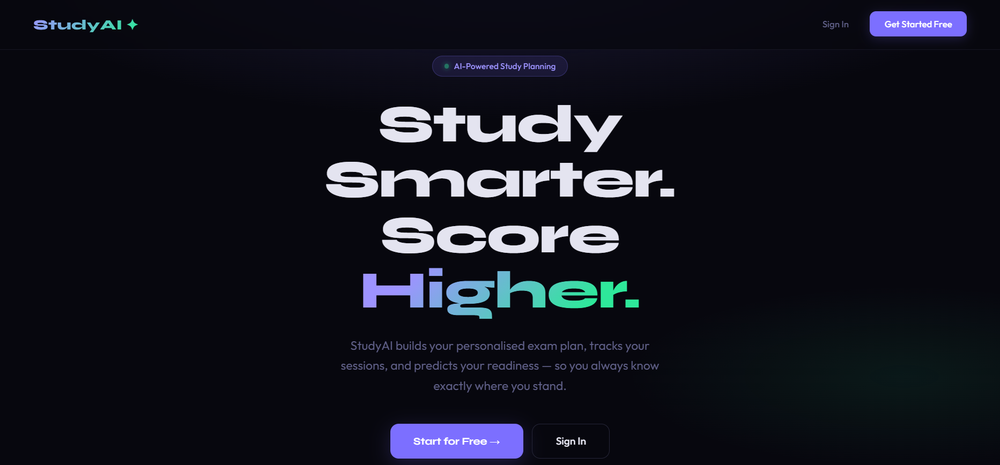
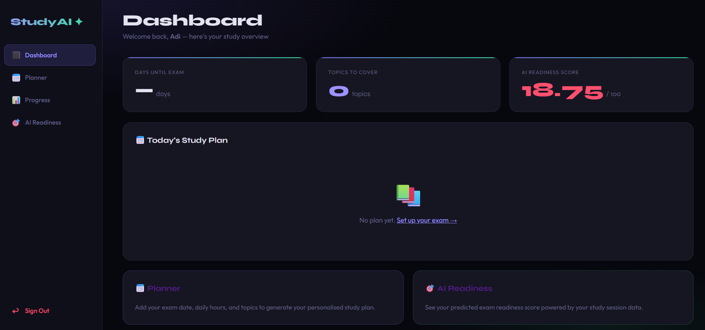
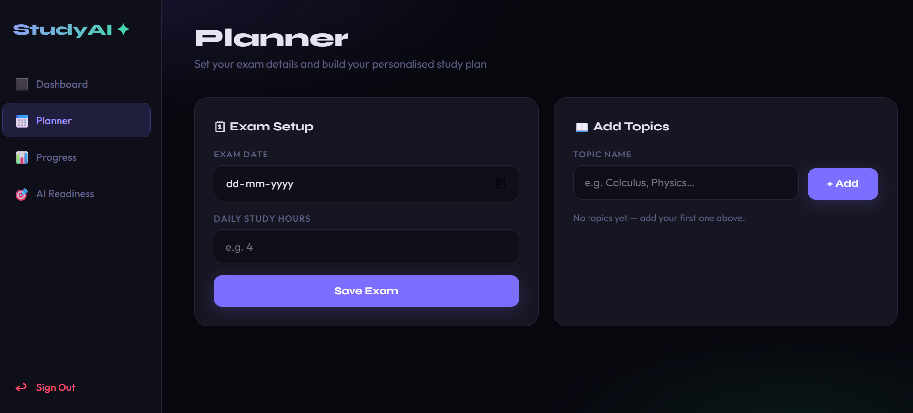

# StudyAI — Smart Learning Planner

> An AI-powered exam preparation web app that builds your personalised study plan, tracks your sessions, and predicts your exam readiness.

## 🌐 Live Demo

👉 **[https://smart-learning-planner.onrender.com](https://smart-learning-planner.onrender.com)**


---

## 📸 Screenshots

### 🌐 Landing Page


### 📊 Dashboard


### 📅 Planner


---

## ✨ Features

- 🔐 **JWT Authentication** — Secure register & login with hashed passwords
- 📅 **Smart Planner** — Set exam date, daily hours, and topics to get a balanced daily study plan
- 📊 **Progress Tracker** — Log study sessions and monitor your total hours
- 🎯 **AI Readiness Score** — Predicts your exam readiness based on your study data
- 🗓 **Daily Breakdown** — Know exactly what to study each day
- 🌐 **Landing Page** — Clean, modern landing page for new visitors

---

## 🛠 Tech Stack

| Layer | Technology |
|---|---|
| Backend | Python, Flask |
| Database | SQLite, SQLAlchemy |
| Auth | Flask-JWT-Extended, Werkzeug |
| Frontend | Jinja2 HTML Templates, CSS |
| AI Engine | Custom readiness prediction algorithm |
| CORS | Flask-CORS |

---

## 📁 Project Structure

```
smart-learning-planner/
├── app.py                  # Flask app entry point
├── config.py               # App configuration
├── models.py               # Database models
├── requirements.txt        # Python dependencies
├── routes/
│   ├── __init__.py
│   ├── auth.py             # Register & login API
│   ├── planner.py          # Exam, topic & plan API
│   ├── ai.py               # AI readiness API
│   └── main.py             # Frontend routes
├── ml/
│   ├── __init__.py
│   └── readiness.py        # Readiness score algorithm
├── templates/
│   ├── base.html           # Base layout with sidebar
│   ├── index.html          # Landing page
│   ├── login.html          # Login page
│   ├── register.html       # Register page
│   ├── dashboard.html      # Main dashboard
│   ├── planner.html        # Study planner
│   ├── progress.html       # Session tracker
│   └── ai_insights.html    # AI readiness page
└── static/
    ├── css/
    ├── js/
    └── images/
```

---

## ⚙️ Installation & Setup

### 1. Clone the repository
```bash
git clone https://github.com/sujan011/smart-learning-planner.git
cd smart-learning-planner
```

### 2. Create and activate virtual environment
```bash
python -m venv venv

# Windows
venv\Scripts\activate

# Mac/Linux
source venv/bin/activate
```

### 3. Install dependencies
```bash
pip install -r requirements.txt
```

### 4. Run the app
```bash
python app.py
```

### 5. Open in browser
```
http://127.0.0.1:5000
```

---

## 🔌 API Endpoints

### Auth
| Method | Endpoint | Description |
|---|---|---|
| POST | `/auth/register` | Register a new user |
| POST | `/auth/login` | Login and get JWT token |

### Planner
| Method | Endpoint | Description |
|---|---|---|
| POST | `/planner/exam` | Add exam date and daily hours |
| POST | `/planner/topic` | Add a study topic |
| GET | `/planner/plan` | Get daily study plan |

### AI
| Method | Endpoint | Description |
|---|---|---|
| GET | `/ai/readiness` | Get AI readiness score |

---

## 🧠 How the AI Readiness Score Works

The score (0–100) is calculated using a weighted formula:

```
Score = (hours_score × 0.40) + (completion_score × 0.35) + (confidence × 0.25)
```

| Factor | Weight | Description |
|---|---|---|
| Total Study Hours | 40% | Capped at 100 hours max |
| Syllabus Completion | 35% | Based on sessions completed |
| Confidence Level | 25% | Default confidence value |

As you log more study sessions, your score grows automatically:

| Sessions Logged | Approx Score |
|---|---|
| 1 session | ~18 |
| 5 sessions | ~40+ |
| 10 sessions | ~60+ |
| 20+ sessions | ~80+ |

---

## 🤝 Contributing

Pull requests are welcome! For major changes, please open an issue first to discuss what you would like to change.

---

## 📄 License

This project is open source and available under the [MIT License](LICENSE).

---

## 👨‍💻 Author

Built with ❤️ by **SUJAN**

> ⭐ If you found this helpful, please give it a star on GitHub!


